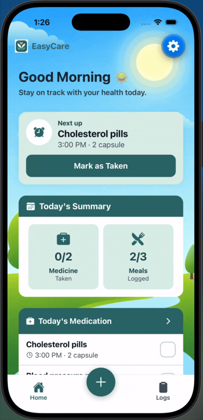
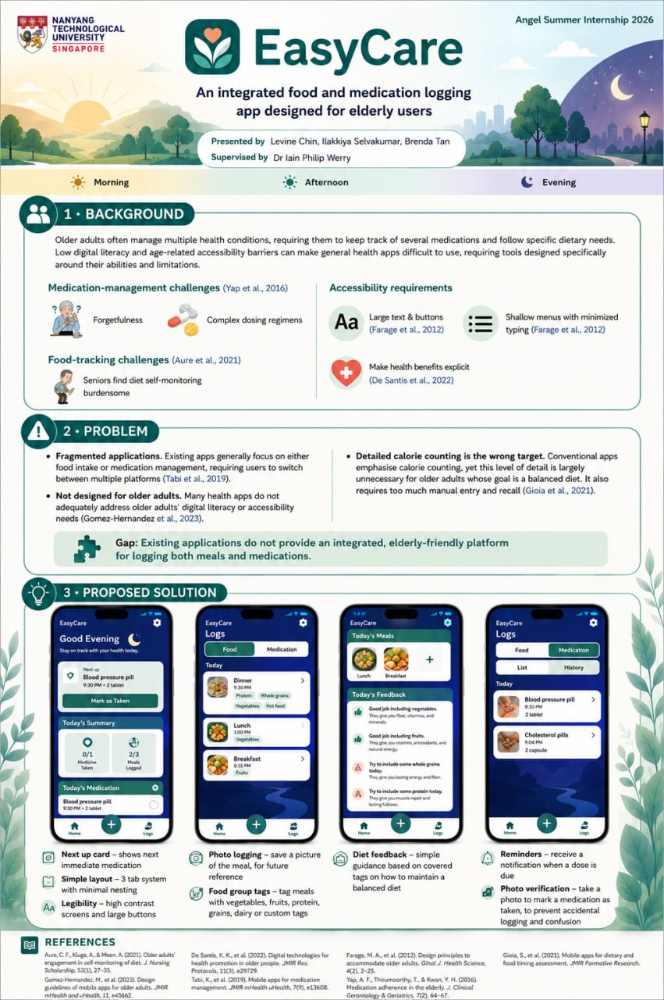

# EasyCare

Older adults often manage multiple health conditions, requiring them to follow specific dietary needs and keep track of several medications. Complex dosing schedules and forgetfulness can lead to missed doses, while low digital literacy and age-related accessibility barriers can make general health-tracking apps difficult to use.

EasyCare is an elderly-friendly food and medication logging app designed around seniors’ needs and abilities. It helps them track their meals and manage their medication schedules easily, supporting a healthy diet and improving medication adherence.

## Features

### 🍽️ Food Logging

<table>
<tr>
<td align="center"><br><sub>Meal logging</sub></td>
<td align="center"><br><sub>Custom dietary tags</sub></td>
</tr>
</table>

- Log meals with photos for easy reference
- Tag food groups to monitor dietary balance without detailed calorie counting
- Create custom dietary tags based on individual health needs
- Receive simple feedback on the Home tab to support a balanced diet

### 💊 Medication Tracking

<table>
<tr>
<td align="center"><br><sub>Adding a medication</sub></td>
<td align="center"><br><sub>Logging a dose</sub></td>
</tr>
</table>

- View the next scheduled dose and all of today’s medications at a glance
- Add, edit, and delete medications, including their dosage, frequency, and scheduled days
- Receive push notifications for upcoming doses
- Mark doses as taken with photo confirmation to reduce accidental entries
- View a complete history of logged doses and their timing

### ♿ Accessibility

- Large text (15 pt or above), high-contrast colours, and touch targets of at least 48 px
- Consistent back navigation with shallow, uncluttered menus
- Confirmation steps to prevent accidental entries and actions

## Research

EasyCare’s features are informed by a literature review examining the challenges older adults face, accessible design principles, and existing food and medication logging apps. Read the full review at [literature_review.md](literature_review.md).



## Getting started

Built with [Expo](https://expo.dev) (SDK 56) / React Native and React Navigation on the frontend, and [Supabase](https://supabase.com) (Postgres + Storage) as the backend, with expo-notifications for reminders and expo-image-picker for photo logging.

**Prerequisites:** Node.js and the [Expo Go](https://expo.dev/go) app (or an iOS/Android simulator).

### 1. Create a Supabase project

Create a Supabase project at [supabase.com](https://supabase.com).

### 2. Set up the database

Open [supabase/schema.sql](supabase/schema.sql), copy its contents into the **SQL Editor** in your Supabase project, and run it. This creates the `medications`, `medication_logs`, `meals`, and `custom_food_tags` tables and the two photo storage buckets the app needs.

### 3. Clone and configure the app

```bash
git clone <repo-url>
cd EasyCare
npm install
cp .env.example .env
```

In your Supabase project, go to **Settings → API** and copy two values into `.env`:

- `EXPO_PUBLIC_SUPABASE_URL` — the Project URL
- `EXPO_PUBLIC_SUPABASE_PUBLISHABLE_KEY` — the publishable (anon) key

### 4. Run it

```bash
npx expo start
```

Scan the QR code with Expo Go, or press `i` / `a` in the terminal to launch a simulator.
